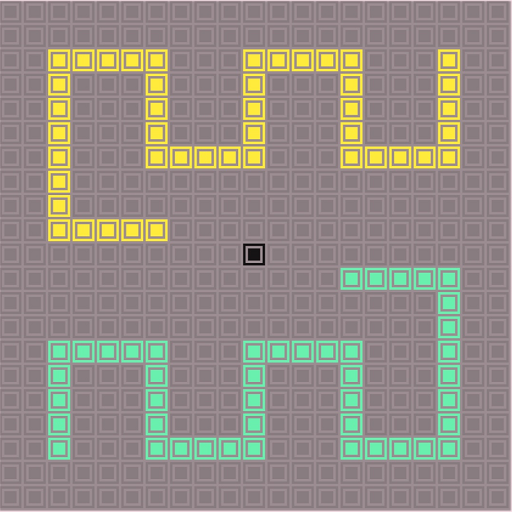
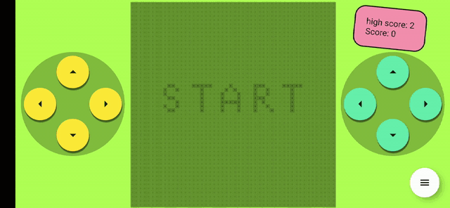
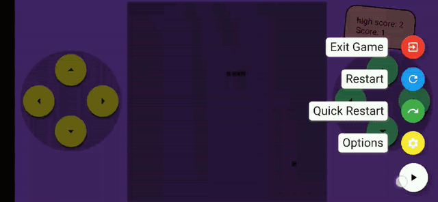
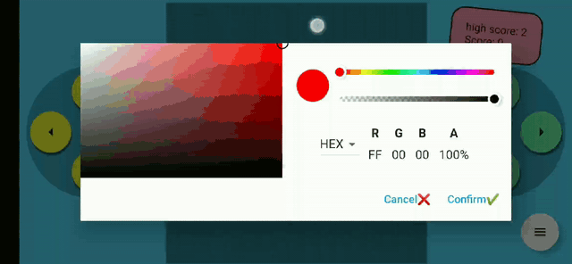

<!-- PROJECT SHIELDS -->
<!--
*** I'm using markdown "reference style" links for readability.
*** Reference links are enclosed in brackets [ ] instead of parentheses ( ).
*** See the bottom of this document for the declaration of the reference variables
*** for contributors-url, forks-url, etc. This is an optional, concise syntax you may use.
*** https://www.markdownguide.org/basic-syntax/#reference-style-links
-->
[![MIT License][license-shield]][license-url]
<!-- [![LinkedIn][linkedin-shield]][linkedin-url] -->


<!-- PROJECT LOGO -->
<br />
<p align="center">
  <a href="https://github.com/zoujiemeng/twosnakes-by-flutter">
    
  </a>

<h3 align="center">twosnakes-by-flutter</h3>

  <p align="center">
    A snake game with two player mode powered by Flutter
    <br />
    <a href="https://play.google.com/store/apps/details?id=com.jaytown.twosnakes"><strong>Get it at Play Store »</strong></a>
    <br />
    <br />
    <a href="https://github.com/zoujiemeng/twosnakes-by-flutter">View Demo</a>
    ·
    <a href="https://github.com/zoujiemeng/twosnakes-by-flutter/issues">report Bug</a>
    ·
    <a href="https://github.com/zoujiemeng/twosnakes-by-flutter/issues">Request Feature</a>
  </p>
</p>


For Chinese instruction, please refer to [中文项目简介](./README_CHS.md)

<!-- TABLE OF CONTENTS -->
## Table of Contents

* [About the Project](#about-the-project)
    * [One Player Mode](#One-Player-Mode)
    * [Two Player Mode](#Two-Player-Mode)
    * [Change Color](#Change-Color)
    * [Built With](#built-with)
* [Getting Started](#getting-started)
    * [Installation](#installation)
    * [Set up an editor](#Set-up-an-editor)
    * [play with app](#play-with-app)
* [Roadmap](#roadmap)
* [Contributing](#contributing)
* [License](#license)
* [Contact](#contact)
* [Acknowledgements](#acknowledgements)


<!-- ABOUT THE PROJECT -->
## About The Project
This is a snake game powered by Flutter with one or two player mode. Everything you can see in this app is generated by code. The most interesting part for me is I can play the game with a friend and change the color of almost everything at anytime.

### One Player Mode
one player mode is just like traditional snake game, player could use both controller to control the snake, Please refer to the following demo. by the way, the gif compression algorithm lost too much details for this app, it is highly recommended to get app at [Google Play Store](https://play.google.com/store/apps/details?id=com.jaytown.twosnakes) or watch [HD video at youtube](https://youtu.be/fRPARjtkeR8).


### Two Player Mode
two player mode is two player control a snake separately to compete for one foodpack using their own controller.


### Change Color
user can change color of almost everything at anytime, and the changes take effect realtime even during the game. In fact, the render rate of widgets is quite high in this app since its a game app, and there is only one red bar(stands for a jank) occurred during a 5 minutes performance test.



### Built With

* [Flutter](https://flutter.dev/)

<!-- GETTING STARTED -->
## Getting Started

To get a local copy up and running follow these simple steps.

### Installation

If you have never used Flutter before, you can install Flutter following [this instruction](https://flutter.dev/docs/get-started/install).

### Set up an editor

After the Installation, you may choose a editor you like. Android Studio and VS code are recommended.

### play with app

1. Clone the twosnakes-by-flutter
```sh
git clone https://github.com/zoujiemeng/twosnakes-by-flutter.git
```

2. open the directory and run the app following [this instruction](https://flutter.dev/docs/get-started/test-drive).

3. Make a change to app source and save the changed file then you can see the change take effect almost immediately on your device! This cool feature is provided by Hot Reload of Flutter.

<!-- ROADMAP -->
## Roadmap

See the [open issues](https://github.com/zoujiemeng/twosnakes-by-flutter/issues) for a list of proposed features (and known issues).


<!-- CONTRIBUTING -->
## Contributing

Contributions are what make the open source community such an amazing place to be learn, inspire, and create. Any contributions you make are **greatly appreciated**.

1. Fork the Project
2. Create your Feature Branch (`git checkout -b feature/AmazingFeature`)
3. Commit your Changes (`git commit -m 'Add some AmazingFeature'`)
4. Push to the Branch (`git push origin feature/AmazingFeature`)
5. Open a Pull Request


<!-- LICENSE -->
## License
Distributed under the MIT License. See `LICENSE` for more information.


<!-- CONTACT -->
## Contact

Zou Jiemeng - [@jiemengzou](https://twitter.com/jiemengzou) - jiemengzou@gmail.com

Project Link: [https://github.com/zoujiemeng/twosnakes-by-flutter](https://github.com/zoujiemeng/twosnakes-by-flutter)


<!-- ACKNOWLEDGEMENTS -->
## Acknowledgements

* [Flutter](https://github.com/flutter/flutter)
* [flutter-tetris](https://github.com/boyan01/flutter-tetris)
* [Package:orientation](https://pub.dev/packages/orientation)
* [Package:provider](https://pub.dev/packages/provider)
* [Package:vibration](https://pub.dev/packages/vibration)
* [Package:flutter_speed_dial](https://pub.dev/packages/flutter_speed_dial)
* [Package:flutter_colorpicker](https://pub.dev/packages/flutter_colorpicker)
* [Package:shared_preferences](https://pub.dev/packages/shared_preferences)
* [Readme template](https://github.com/othneildrew/Best-README-Template)


<!-- MARKDOWN LINKS & IMAGES -->
<!-- https://www.markdownguide.org/basic-syntax/#reference-style-links -->
[license-shield]: https://img.shields.io/github/license/othneildrew/Best-README-Template.svg?style=flat-square
[license-url]: https://github.com/zoujiemeng/twosnakes-by-flutter/blob/master/LICENSE
[linkedin-shield]: https://img.shields.io/badge/-LinkedIn-black.svg?style=flat-square&logo=linkedin&colorB=555
[linkedin-url]: https://linkedin.com/in/othneildrew
